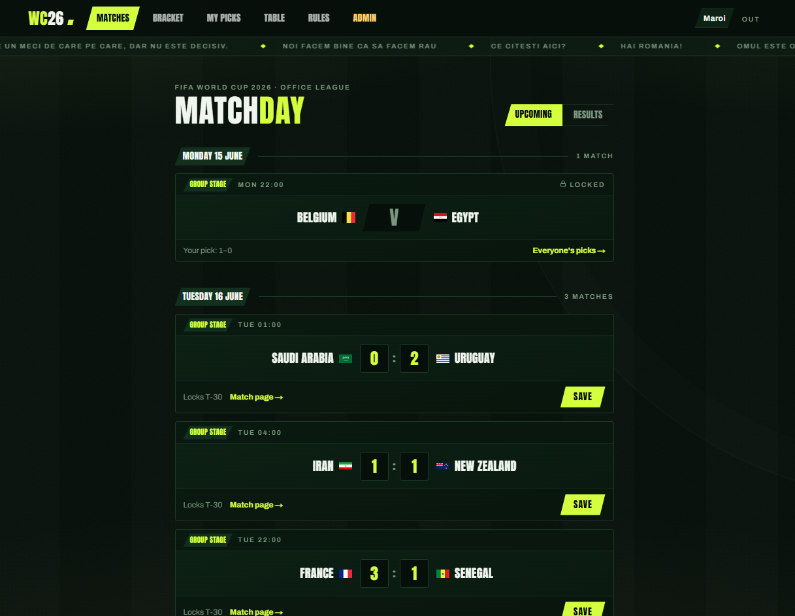

# ⚽ WC2026 Office Predictor

A private World Cup 2026 prediction game for your office. Next.js + Supabase,
with [football-data.org](https://www.football-data.org) (API v4) as the source
of truth for fixtures and scores.



- **Invite-only** — no public sign-up; the admin creates accounts.
- **Blind predictions** — nobody sees colleagues' picks until a match locks
  (30 min before kick-off). Enforced by Postgres Row Level Security, not just the UI.
- **Hard deadlines** — the database rejects any write after T-30, whatever the client says.
- **Automatic scoring** — per-match points, worth a touch more in the elimination
  round, plus a group-winner side bet. The database does the math (see [Scoring](#scoring) below).
- **Free-tier friendly** — the app never calls football-data.org from page loads; a
  rationed sync job stays far under the free tier's 10 requests/minute cap.

## Scoring

Two ways to earn points — predict each match, and predict the 12 group winners.
All scoring is automatic; the formula lives in the database (`calc_match_points` /
`score_match` in [`supabase/schema.sql`](supabase/schema.sql)), so nobody argues with it.

**Per match** — predict the score after 90′ (or 120′ if it goes to extra time;
penalty-shootout goals never count toward the score):

| Tier | Points | When |
|---|---|---|
| **Bulls-eye** | 3 / 4 | Exact score — 3 in the group stage, 4 in the elimination round. |
| **Goal difference** | 2 | Right goal difference but not the exact score — the same winning margin (e.g. 3–1 vs 2–0), or a draw called as a draw (e.g. 1–1 vs 2–2). |
| **Right team** | 1 | Right winner, wrong margin (decisive results only — a draw lands in the tier above). |
| **Air ball** | 0 | Wrong outcome. |

The bulls-eye (exact-score) reward steps up once for the knockout rounds; the
goal-difference (+2) and right-team (+1) tiers are the same at every stage:

| Stage | Exact score |
|---|---|
| Group stage | +3 |
| Elimination round | +4 |

**Group winners (+3 each)** — call the winner of each of the 12 groups before the
tournament starts. Max 36 points. This is the only tournament-level pick: the
knockout bracket builds itself automatically as rounds are played and carries no points.

**Tie-breakers** — total points, then most bulls-eyes (exact scores), then most
group-stage points.

## 1. Set up Supabase

1. Create a project at [supabase.com](https://supabase.com).
2. Open **SQL Editor**, paste the whole of [`supabase/schema.sql`](supabase/schema.sql), run it.
3. In **Authentication → Sign In / Up**, disable **Allow new users to sign up**
   (accounts are created by you only).
4. In **Authentication → URL Configuration**, set the Site URL to your deployed URL and add
   `https://your-app/auth/confirm` to the redirect list (needed if you use email invites).
5. Copy the project URL, anon key and service-role key from **Project Settings → API**.

## 2. Configure & run

```bash
cp .env.example .env.local   # fill in the values
npm install
npm run dev
```

## 3. Make yourself admin

Create your own account first (easiest: Supabase dashboard **Authentication → Users →
Add user**, with "Auto confirm" on). Then in the SQL Editor:

```sql
update public.profiles set is_admin = true
where id = (select id from auth.users where email = 'you@company.com');
```

## 4. Seed the schedule

Open **/admin** in the app and press **Seed full schedule** (1 API request pulls
all fixtures; team/group mappings are derived from them). Then set the three lock times:

| Setting | Per the rules |
|---|---|
| Group winner picks lock | Opening match kick-off − 2 h |

## 5. Create player accounts

From **/admin → Create player account** (email + temp password + nickname), or send
invites from the Supabase dashboard (**Authentication → Users → Invite user** — the
invite link routes through `/auth/confirm` and asks them to set a password).
Players pick their leaderboard nickname on **/profile**.

## 6. Schedule the sync job

`GET /api/cron/sync` (secured by `CRON_SECRET`) is the only thing that talks to
football-data.org. It is safe to call every 10 minutes — it only spends an API
request when:

- today's fixtures haven't been fetched yet (the "03:00 daily fetch"), or
- a match is inside its live window (kick-off − 10 min → +3.5 h, until the API
  reports the match finished).

After every tick it scores finished matches, fills knockout-round results, and — once
the Round-of-32 draw exists — spends one extra request on standings to record the
official group winners. That is at most ~1 request per 10 minutes, far inside the
free tier's 10 requests/minute limit.

The secret must be sent in the **`Authorization: Bearer` header** — the endpoint
deliberately ignores a `?secret=` query param (query strings leak into request and
proxy logs).

**Every-10-minutes trigger — [cron-job.org](https://cron-job.org) (free):**

- URL: `https://your-app/api/cron/sync`
- Schedule: every 10 minutes
- Under "Headers", add: `Authorization: Bearer YOUR_CRON_SECRET`

Alternatives: a GitHub Actions `schedule:` workflow that `curl`s the same URL with the
same header, or Vercel Pro with `vercel.json` set to `*/10 * * * *`.

> The free Vercel (Hobby) plan only runs crons **once per day**, which is why this app
> relies on an external 10-minute trigger instead. `vercel.json` ships with no cron. If
> you want a daily backstop on top of the external cron, add
> `{ "crons": [{ "path": "/api/cron/sync", "schedule": "0 3 * * *" }] }` — Vercel sends
> the `Authorization: Bearer $CRON_SECRET` header automatically.

## 7. Deploy

Push to GitHub → import in Vercel → set the five env vars from `.env.example` →
deploy. Point your colleagues at the URL, collect the buy-ins, print the trophy. 🏆

## How fairness is enforced (for the office lawyers)

- **T-30 lock**: RLS policies call `match_is_open()`, which compares `now()` against
  `kickoff - 30 minutes` *in the database*. A request at 19:31 for a 20:00 match fails
  with a permission error regardless of what the UI allowed.
- **Blind picks**: the predictions `SELECT` policy only returns other people's rows
  once the match is locked.
- **Audit trail**: `predictions.updated_at` is maintained by a DB trigger — disputes
  are settled with one SQL query.
- **No score tampering**: users can only write `home_goals`/`away_goals`
  (column-level grants); `points` is written exclusively by the `score_match()` function,
  which runs only after football-data.org reports a final status.

